# WIRKUNG Wristlink Konfigurator – Technische Dokumentation

Diese Datei beschreibt Logik, Berechnungen und interne Regeln des B2B-Konfigurators (`/konfigurator`). Kunden sehen technische Details wie Kanalanzahl (40/80 CH) **nicht** – sie werden serverseitig ermittelt und in Anfragen gespeichert.

---

## Ablauf (6 Schritte)

| Schritt | Label | Inhalt |
|--------|--------|--------|
| 0 | Event | Kontakt inkl. **Firmenadresse** (Straße, PLZ, Ort), Szenario, Eventadresse, Zeitraum (`von` / `bis`) |
| 1 | Umfang | Produkt (nur LED Armband wählbar; LED Ball, LED Platine, LED Lanyard, LED-Licht ausgegraut mit Strichzeichnungen), Miete/Kauf, Menge, Bedruckung + Probedruck-Optionen (nur Kauf) |
| 2 | Zeitraum | Verfügbarkeitsprüfung Bänder (+ Controller, falls schon gewählt), Lieferhinweis bei kurzem Vorlauf |
| 3 | Steuerung | Variante Standard/Premium (nur Armband), Basis-Station, Gruppenprogrammierung (nur PRO) |
| 4 | Extras | Lieferland (nur DE), Lieferpakete (Regulär / Express / Eilauftrag), Flex-Rückgabe, Techniker |
| 5 | Angebot | Zusammenfassung, Preis, Absenden |

Vor dem Konfigurator: **E-Mail-Gate** mit:

- Pflichtfelder: Name, Firma, Telefon, geschäftliche E-Mail
- **B2B-Pflicht-Checkbox** (`B2B_CONFIRMATION_TEXT` in `lib/konfigurator/consent.ts`)
- CRM-Hinweis + Link zur Datenschutzerklärung
- Optionale Marketing-Einwilligung (wirksam **erst nach** Double-Opt-In)
- Double-Opt-In per E-Mail (`/konfigurator/verify?token=…`)

Consent-Versionierung: `CONSENT_TEXT_VERSION` (aktuell 1.4), Speicherung von `consent_ip` und `consent_text_version` auf `leads`. Marketing-Intent bis DOI in `email_verification_tokens.marketing_consent_pending` (Migration 11).

**E-Mail-Domains:** Allgemein `@wirkung-digital.de` · Absender/Team `@braceled-led-armband.com` → `lib/contact-emails.ts`

**Testmode:** DOI-Bypass nur in Development oder mit `KONFIGURATOR_TESTMODE_ENABLED` + Secret in Production; UI-Button nur außerhalb Production.

### Kontaktdaten & Firmenadresse (Schritt 0)

Pflichtfelder neben Ansprechpartner und Telefon:

| Feld | `QuoteConfig` | Hinweis |
|------|---------------|---------|
| Firma | `kontaktFirma` | |
| Straße und Hausnummer | `kontaktStrasse` | |
| Postleitzahl | `kontaktPlz` | **5-stellig – wird Zugangscode für die Kunden-Statusseite** |
| Ort | `kontaktOrt` | |

Im Wizard erscheint ein kurzer Hinweis: Die PLZ dient als Zugangscode für die Statusseite (Link in den E-Mails).

Hilfsfunktionen: `lib/konfigurator/kontakt-adresse.ts` (`formatKontaktAdresse`, `getQuoteAccessPlz`, `isKontaktAdresseComplete`).

### Kunden-Statusseite (`/angebot/[token]`)

Öffentliche Seite pro Anfrage (`public_token`):

- **PLZ-Gate:** Eingabe der Firmen-PLZ (`POST /api/angebot/[token]/unlock`), danach HttpOnly-Cookie (30 Tage, Pfad `/angebot`)
- **Inhalt:** Angebotsstatus, Stripe-Zahlungslink, Fulfillment-Timeline, Konfiguration, Preisübersicht (B2B)
- **Rate-Limit:** 10 Versuche / 15 Min. pro IP und Token

Implementierung:

| Modul | Zweck |
|-------|--------|
| `lib/konfigurator/plz.ts` | PLZ normalisieren, vergleichen, aus Adresse extrahieren (client-sicher) |
| `lib/konfigurator/angebot-access.ts` | Server: Cookie setzen/prüfen nach erfolgreicher PLZ |
| `components/angebot/plz-gate.tsx` | PLZ-Eingabe |
| `components/angebot/angebot-status-view.tsx` | Status-UI inkl. Fulfillment-Timeline |

---

## Standard vs. Premium (Armband)

| Aspekt | Standard | Premium |
|--------|----------|---------|
| Physisches Produkt | **Identisch** – gleicher Lagerbestand | **Identisch** |
| Verfügbarkeitsprüfung | Nur `produkt: "armband"` + passende Leuchtgruppen | Gleich – `variante` fließt **nicht** in die Bestandslogik |
| Preis | Basis-Stückpreis | +10 % auf Produkt-Stückpreis |
| Steuerung (UX) | Fernsteuerung per Handcontroller (ECO) | Handcontroller oder PRO Basis-Station |

Die Variante wird in Schritt 3 gewählt, **nach** der ersten Verfügbarkeitsprüfung in Schritt 2. Das ist beabsichtigt: Engpass ist Menge/Zeit, nicht die Variante.

---

## Preisberechnung (`lib/pricing/preis-engine.ts`)

Alle Preise **netto (B2B)**. Zahlung in Deutschland: zzgl. 19 % MwSt.

### Produkte im Konfigurator (Schritt Umfang)

| Produkt | `value` | UI | Hinweis |
|---------|---------|-----|---------|
| LED Armband | `armband` | ✓ wählbar | Einziges aktives Produkt; Strichzeichnung in der Karte |
| LED Ball | `ball` | ausgegraut | „Aktuell hier nicht konfigurierbar“ |
| LED Platine | `platine` | ausgegraut | LED Platine zum Einbau in eigene Event-Elemente (nicht Untersetzer) |
| LED Lanyard | `lanyard` | ausgegraut | „Aktuell hier nicht konfigurierbar“ |
| LED-Licht | `licht` | ausgegraut | IP68-EventLights (Pool/See/Eiskühler) – nur Vorschau |
| LED Zauberstab | `zauberstab` | – | Nicht in der Produktauswahl (nur API/Legacy) |

- Produktkarten mit Strichzeichnungen: `public/images/konfigurator/products/` (Quelle: [led-leuchtarmbaender.com/produkte](https://www.led-leuchtarmbaender.com/produkte))
- Konfiguration: `PRODUCT_OPTIONS` + `PRODUCT_UNAVAILABLE_HINT` in `lib/konfigurator/product-info.ts`
- Preis-Engine blockiert alle Produkte mit `available: false` über `isProductKonfiguratorAvailable()`

Staffelpreise **100–4.000** (Schritt 50) für Kauf und Miete pro Stück (nur `armband` im Konfigurator). Tabellen in `lib/pricing/preis-engine.ts` (`armband` bis 4.000; `zauberstab`/`licht` bis 2.500 für API/Legacy).

### Zuschläge & Positionen

| Position | Regel |
|----------|--------|
| Premium-Variante | +10 % auf Produkt-Stückpreis (nur Armband) |
| Bedruckung (Kauf) | Setup 120 EUR + Stückpreis nach Staffel |
| Probedruck + Fotos | 149 EUR netto (optional, nur Kauf + Bedruckung, Schritt Umfang; `probedruckOption: "fotos"`) |
| Probedruck + Versand | 189 EUR netto (optional, nur Kauf + Bedruckung; `probedruckOption: "versand"`) |
| Gruppenprogrammierung | 65 EUR netto **pro programmierter Gruppe** (nur PRO-Station) |
| Basis-Station ECO | Kauf 399 / Miete 250 EUR netto |
| Basis-Station PRO | Nur Miete 649 EUR netto |
| **Lieferpaket Regulär** | 100 EUR netto (20 WT Produktion, Anlieferung bis 2 Tage vor Event, Rückversand 3 WT) |
| **Lieferpaket Express** | 349 EUR netto (10 WT Produktion, gleiche Anlieferung) |
| **Lieferpaket Eilauftrag** | 919 EUR netto (48 h Produktion + Overnight UPS/TNT, keine Bedruckung) |
| Flex-Rückgabe | +199 EUR netto (optional bei Regulär/Express: frühere Anlieferung ≥5 WT, Rückversand 8 WT) |
| Versand DE | 90 EUR netto (nur Deutschland im Online-Konfigurator) |
| Techniker | Reisepauschale 400 EUR, 1.200 EUR/Tag, 0,50 EUR/km ab Wehrheim; **min. 7 Tage Vorlauf** |

### Lieferpakete (`lib/konfigurator/lieferpaket.ts`)

Kunde wählt **ein Paket** statt getrennt Lieferzeit + Lieferart. Intern werden `lieferzeit`, `lieferart` und `flex` weiter abgeleitet.

| Paket | `lieferpaket` | Min. Tage bis Event | Bedruckung |
|-------|---------------|---------------------|------------|
| Regulär | `regulaer` | 28 | erlaubt |
| Express | `express` | 14 | erlaubt |
| Eilauftrag | `eil` | 2 | nicht möglich |

Bei zu kurzem Vorlauf werden nicht verfügbare Pakete ausgegraut; das schnellste noch mögliche Paket wird vorausgewählt.

`lib/konfigurator/lieferzeit.ts` ist **deprecated** – enthält nur Legacy-Kompatibilitäts-Shims für Tests (`scripts/test-lieferzeit.ts`). Neue Logik ausschließlich in `lieferpaket.ts`.

### Validierung (Auszug)

- Menge **100–4.000**, Schritt 50 (`MIN_MENGE`, `MAX_MENGE`, `MENGE_STEP` in `product-info.ts`)
- Gruppen 0–20; mit PRO-Station mindestens **1 Gruppe**
- Gruppenprogrammierung nur mit `station === "pro"`
- Bedruckung nur bei Kauf; nicht bei Eilauftrag (`lieferpaket: eil`)
- PRO-Station nur Miete
- LED Ball, LED Platine, LED Lanyard und LED-Licht im Konfigurator nur Vorschau („Aktuell hier nicht konfigurierbar“)
- Techniker nur ab 7 Tagen Vorlauf bis Event
- Lieferland Online-Konfigurator: nur Deutschland

---

## Verfügbarkeit – Übersicht

```mermaid
flowchart TD
  subgraph bands [LED-Bänder]
    A[resolveKanalanzahl] --> B[Leuchtgruppen mit passender CH]
    B --> C[Aggregate Bestand / Belegung]
    C --> D[Stress-Ampel + Kurzvorlauf-Floor]
  end
  subgraph ctrl [Controller]
    E[station_typ + kanalanzahl] --> F[bases-Tabelle]
    F --> G[1 Gerät pro Basis-Datensatz]
    G --> H[Stress-Balken ohne Zahlen]
  end
  subgraph grp [Gruppenprogrammierung PRO]
    I[gruppenGroessen pro Slot] --> J[Flexible Zuordnung G-Pools]
    J --> K[Max 3 physische Lagergruppen]
  end
```



### Kunden-UI: keine absoluten Stückzahlen

Bei Bändern und Controllern werden **keine** freien/belegten Stückzahlen angezeigt – nur:

- Farbverlauf-Balken (Stress-Score 0–100 %)
- Textlabel (z. B. „Entspannt“, „Kurzer Vorlauf – nur Lagerbestand“)
- Qualitative Aussage: „voraussichtlich verfügbar“ / „nicht verfügbar“

Intern bleiben `frei`, `bestand`, `belegt` in der API für Berechnungen erhalten.

**Dateien:** `availability-indicator.tsx`, `station-availability-indicator.tsx`, `configurator-wizard.tsx` (Fehlermeldungen ohne „X Stück fehlen“).

---

### Produkt-Verfügbarkeit (Schritt 2)

**Logik:** `lib/actions/n8n-api.ts` → `checkProductAvailability()`

1. Leuchtgruppen über `resolveGroupsForProduct("armband", kanalanzahl)` (nur passende `groups.kanalanzahl`)
2. Freie Bänder über alle Batches je Gruppe aggregieren
3. Buchungen, Vorlauf (`departure_buffer_days`, Default 6 Werktage) und Nachlauf (`return_buffer_days`, Default 5 Tage) berücksichtigen
4. Stress-Ampel: `computeAvailabilityStress()` in `availability-stress.ts`

| Konstante | Wert | Bedeutung |
|-----------|------|-----------|
| `LONG_LEAD_MONTHS` | 4 | Ab 4 Monaten Vorlauf: entspannt grün, auch bei knappem Lager mit Hinweis |
| `SHORT_LEAD_WEEKS` | 3 | Unter 3 Wochen (21 Tage): Ampel **mindestens gelb** |
| `SHORT_LEAD_DAYS` | 21 | = 3 × 7 Tage |
| `SHORT_DELIVERY_WARNING_DAYS` | 14 | Separater Lieferhinweis (siehe unten) |

**Kurzer Vorlauf (< 3 Wochen):** Grün wird per `applyShortLeadFloor()` auf Gelb gecappt mit Label *„Kurzer Vorlauf – nur Lagerbestand“* – weil keine Nachbestellung mehr möglich ist, nur Lagerzugriff.

**Langfristig (≥ 4 Monate):** `verfuegbar = true` auch bei knappem Pool; Hinweis: *„Aktuell knapp auf Lager – mit über 4 Monaten Vorlauf voraussichtlich realisierbar.“*

### Zwei getrennte Vorlauf-Hinweise

| Schwelle | Ebene | Kunden-Hinweis |
|----------|-------|----------------|
| **< 21 Tage** | Verfügbarkeits-Stress (Ampel) | Mindestens Gelb, Label „Kurzer Vorlauf – nur Lagerbestand“ |
| **< 14 Tage** | Lieferumsetzung (Alert) | „Wir müssen prüfen, ob eine Lieferung in der kurzen Zeit möglich ist.“ |

Die 14-Tage-Warnung ist **unabhängig** von der Ampel-Farbe und erscheint als separater Amber-Alert in Schritt 2.

---

### Controller-Verfügbarkeit

**Logik:** `lib/konfigurator/station-availability.ts` → `checkStationAvailability()`

#### Verknüpfung Admin ↔ Konfigurator

Controller werden **nicht** mehr per Namensraten (`eco`/`pro` im Bezeichnungsfeld) gefunden, sondern über:

| Feld in `bases` | Werte | Pflicht bei Neuanlage |
|-----------------|-------|----------------------|
| `station_typ` | `eco` \| `pro` \| `keine` | Ja (Admin „Neue Basis“) |
| `kanalanzahl` | `40` \| `80` | Ja |

Der Konfigurator filtert: `WHERE station_typ = {eco|pro} AND kanalanzahl = {aufgelöste CH}`.

Wenn keine passende Basis hinterlegt ist: `verfuegbar: true` mit Hinweis *„Kein ECO/PRO-Controller hinterlegt – Verfügbarkeit wird manuell geprüft“* (kein Blocker).

#### Bestandszählung pro Basis-Datensatz

Jeder Eintrag in `bases` = **1 physisches Gerät**. Ohne ZUGANG-Buchung gilt `gesamtsumme = 1` (Fix in `getBaseAvailability`, `getBaseAvailabilityByDateRange`, `getBaseStats`).

**Früherer Bug:** Basis ohne ZUGANG-Buchung → Bestand 0 → fälschlich „nicht verfügbar“.

#### UI

- Nur Farbbalken + qualitative Aussage (wie bei Bändern)
- Keine Anzeige „X Controller frei“
- Stress-Labels: „Controller verfügbar“ / „Controller knapp“ / „Controller nicht verfügbar“

Controller-Verfügbarkeit erscheint in Schritt 2 (wenn Station schon gewählt) und Schritt 3 (nach Stationswahl).

---

### Gruppenprogrammierung (nur PRO)

**UI (Schritt 3):**

- Schieberegler **Anzahl Gruppen** (1–20, begrenzt durch `floor(menge / 50)`)
- Pro Gruppe eigener Schieberegler **„Bänder in Gruppe N“** (50er-Schritte)
- Summe aller Gruppen-Bänder ≤ Gesamtmenge (Schritt 1)
- Verfügbarkeitshinweis pro Slot ohne Lager-Stückzahlen

**Preis:** 65 EUR netto × **Anzahl Gruppen** (nicht × Bänder pro Gruppe).

#### Flexible Lager-Zuordnung

Die **Kunden-Gruppe** (Slot 1…N) ist nicht 1:1 an eine feste Lager-G-ID gebunden.

Beispiel: Kunde will 4×100 Bänder. In G1 sind nur 40 frei, in G7 noch 400 – Slot 1 kann als 40 aus G1 + 60 aus G7 zugewiesen werden.

**Logik:** `lib/konfigurator/group-allocation.ts`

1. `getInventoryGroupPools()` – freie Bänder je Leuchtgruppe (gefiltert nach `kanalanzahl`)
2. `allocateGroupProgramming()` – testet Kombinationen aus höchstens **3 physischen Lagergruppen** (`MAX_PHYSICAL_GROUPS = 3`)
3. Pro Slot: Greedy-Zuteilung aus den gewählten Pools (größte Freiheit zuerst)
4. Ergebnis: `slots[]` mit `zuteilungen[]` (intern, nicht im Kunden-UI)

**Max-3-Regel:** Über alle Kunden-Slots hinweg dürfen höchstens 3 **verschiedene** `group_id`s gleichzeitig genutzt werden – unabhängig davon, wie die G-IDs heißen (G1, G7, G12_80ch, …).

**API:** `POST /api/konfigurator/session` mit `action: "group-availability"`.

---

## Kanalanzahl 40 / 80 CH (nur intern)

**Nicht im Kunden-UI.** Auflösung: `lib/konfigurator/resolve-kanalanzahl.ts`

| Situation | Regel |
|-----------|--------|
| Produkt ≠ Armband | Immer 40 CH (Default) |
| **≥ 11 programmierte Gruppen** | **Pflicht 80 CH** (`GRUPPEN_80CH_MIN = 11`, d. h. `gruppen > 10`) |
| Bis 10 Gruppen | 40 oder 80 CH – automatisch nach Verfügbarkeit |
| Bevorzugung | Zuerst 40 CH prüfen, dann 80 CH |
| Prüfung je CH | Produkt-Verfügbarkeit, Controller (falls gewählt), Gruppenprogrammierung (falls PRO) |

Die aufgelöste Kanalanzahl wird in `config.kanalanzahl` gespeichert (Submit, Admin-Anfragen).

**40 CH und 80 CH** betreffen sowohl **Bändchen** (Leuchtgruppen) als auch **Controller** (Basen) – beide müssen zur gleichen Kanalanzahl passen.

### Leuchtgruppen im Admin

**Empfohlenes Namensschema:** `G{Slot}_{40|80}ch` (z. B. `G1_40ch`, `G12_80ch`)

- Slots G1–G20 (`LEUCHTGRUPPE_MAX_SLOT`)
- `createGroup({ slot, kanalanzahl })` erzeugt den Namen automatisch
- `product-mapping.ts`: `isArmbandLeuchtgruppe()` erkennt `G{n}_{40|80}ch` als Armband-Lagergruppe
- Spalte `groups.kanalanzahl` (Migration `08-groups-kanalanzahl.sql`, Default 40)

**Legacy-Namen** (z. B. `G1`, `G2`) funktionieren nur, wenn sie über Produkt-Mapping (`WRISTLINK_PRODUCT_MAPPING` / `system_settings.product_mapping`) erfasst sind. Für neue Gruppen immer das Schema `G{n}_{40|80}ch` verwenden.

---

## Gruppenprogrammierung – Kundenregeln

1. Nur bei Auswahl **PRO Basis-Station**
2. Mindestens **1 Gruppe**, maximal 20 (bzw. `floor(menge/50)`)
3. Schieberegler Anzahl Gruppen: 1–max
4. Schieberegler Bänder pro Gruppe: 50er-Schritte, Summe ≤ `menge`, je Gruppe min. 50
5. Preis: 65 EUR netto × Anzahl Gruppen
6. Intern: max. 3 physische Lagergruppen für die Zuordnung

**Config-Felder:** `gruppen` (Anzahl), `gruppenGroessen[]` (Bänder pro Slot). Hilfslogik: `lib/konfigurator/gruppen-config.ts`.

---

## Admin-Workflows

### Neue Leuchtgruppe

Pflichtfelder in Admin → „Neue Gruppe“:

- **Slot** G1–G20 (bereits belegte Slot/CH-Kombinationen sind gesperrt)
- **Kanalanzahl** 40 CH oder 80 CH

Erzeugt automatisch `G{n}_{40|80}ch` + zugehörige SKU (`LED_BAND`).

### Neue Basis (Controller)

Pflichtfelder:

- Bezeichnung, Hersteller
- **Stationstyp:** ECO Handcontroller \| PRO Basis-Station \| Keine Zuordnung
- **Kanalanzahl:** 40 CH \| 80 CH
- Optional: Charge, Firmware, Anzahl (ZUGANG-Buchungen)

Bearbeiten: `EditableBaseRow` – Bezeichnung und `station_typ` änderbar.

### Admin-Tabellen

| Tabelle | Relevante Spalten |
|---------|-------------------|
| Leuchtgruppen | Name, Kanalanzahl |
| Basen | Bezeichnung, Stationstyp, Kanalanzahl, Charge |

### Datenbank-Migrationen

| Migration | Inhalt |
|-----------|--------|
| `07-base-station-typ.sql` | `bases.station_typ` (eco/pro/keine), Backfill aus Bezeichnung |
| `08-groups-kanalanzahl.sql` | `groups.kanalanzahl` (Default 40) |
| `09-fulfillment-email-templates.sql` | Fulfillment, E-Mail-Templates, Zahlungsfelder |
| `13-email-templates-v2.sql` | Überarbeitete Kunden-Mail-Texte + `{{status_url}}`-Hinweise |
| `14-versand-dienstleister.sql` | `versand_dienstleister` auf `quote_requests` und `quote_fulfillment_events` |
| `11-lead-consent-doi.sql` | B2B-Bestätigung, Marketing nach DOI |

---

## Admin: Anfragen & Fulfillment

Übersicht der Admin-Oberfläche für Konfigurator-Anfragen (`/admin/anfragen`).

### Lebenszyklus

```
submitted → approved (ohne Stripe) / payment_pending (mit Stripe)
         → paid → Fulfillment-Schritte → zurueckgepackt
         → rejected / expired / cancelled
```

- **Freigabe ohne Stripe:** für Überweisungen / Rechnung vorab – Kunde erhält Angebotslink, Admin markiert Zahlung manuell.
- **Freigabe mit Stripe:** Checkout-Link per E-Mail; Webhook setzt `paid`.
- **Angebots-PDF:** vor Freigabe manuell anlegen (sevDesk-Button oder Upload); Anhang bei Freigabe- und Zahlungs-Mail – siehe **`docs/sevdesk-angebote.md`**.
- **Fulfillment** startet erst nach `paid` (nicht bei Freigabe).
- **Bestandsbuchung** (Miete): Hold bei Submit; `BESTAETIGT` erst bei Zahlung.

### Fulfillment-Schritte

| Schritt | Mail-Template | Besonderes |
|---------|---------------|------------|
| `angenommen` | – | automatisch bei Zahlung |
| `vorbereitet` | `fulfillment_vorbereitet` | |
| `bedruckt` | `fulfillment_bedruckt` | nur bei Bedruckung |
| `verpackt` | `fulfillment_verpackt` | |
| `versand_beauftragt` | `fulfillment_versand_beauftragt` | Tracking + Versand-Dienstleister (UPS/DHL/TNT) Pflicht |
| `versandt` | `fulfillment_versandt` | |
| `ruecksendung_angekommen` | `fulfillment_ruecksendung_angekommen` | |
| `zurueckgepackt` | `fulfillment_zurueckgepackt` | Rückgabe-Buchung möglich |

Vorlagen editierbar unter `/admin/einstellungen/e-mails`. Kundenfreundliche Standardtexte ab Migration `13-email-templates-v2.sql`.

**Platzhalter:** `{{kunde_anrede}}`, `{{anfrage_id}}`, `{{kunde_name}}`, `{{kunde_firma}}`, `{{angebot_netto}}`, `{{angebot_brutto}}`, `{{zahlungslink}}`, `{{status_url}}`, `{{angebot_url}}`, `{{tracking_nr}}`, `{{versand_dienstleister}}`, `{{tracking_info}}`, `{{kommentar}}`, `{{ablehnungsgrund}}`, `{{zahlungsnotiz}}`

### Fulfillment-Fälligkeit (`lib/konfigurator/fulfillment-timing.ts`)

Berechnet Zieltermine und Dringlichkeit für offene Aufträge (`paid`, Fulfillment nicht abgeschlossen):

| Paket / Phase | Fälligkeit |
|---------------|------------|
| Regulär / Express | Anlieferung bis **2 Kalendertage vor Event** (`config_json.von`) |
| Eilauftrag (`eil`) | **2 Kalendertage nach Zahlung** (`paid_at`) |
| Nach Versand (`versandt` / `ruecksendung_angekommen`) | Rücksendung **3 Werktage nach Eventende** |

Dringlichkeit: `overdue` · `due_today` · `due_soon` (≤3 Tage) · `ok` · `unknown`

Admin-Übersicht `/admin/anfragen`: Karte **„Nächste Aufträge in Bearbeitung“** – die drei dringendsten offenen Aufträge mit Fälligkeitslabel und nächstem Schritt (`components/admin/upcoming-fulfillment-orders.tsx`).

Test: `npx tsx scripts/test-fulfillment-timing.ts`

`{{status_url}}` und `{{angebot_url}}` zeigen auf dieselbe Route (`/angebot/[public_token]`). In Mails wird auf den Zugang mit der **Postleitzahl der Firmenadresse** hingewiesen.

### Admin-UI-Komponenten

| Route / Komponente | Funktion |
|--------------------|----------|
| `/admin/anfragen` | Liste inkl. Fulfillment-Spalte + Prioritäts-Karte (3 dringendste Aufträge) |
| `/admin/anfragen/[id]` | Detail: Freigabe, Zahlung, Fulfillment, Rückgabe |
| `upcoming-fulfillment-orders` | Fälligkeits-Karte auf der Anfragen-Übersicht |
| `quote-approval-actions` | Annehmen/Ablehnen, Stripe-Toggle, Mail-Vorschau |
| `quote-payment-actions` | „Zahlung eingegangen“ (Überweisung) |
| `quote-offer-pdf-upload` | sevDesk-Angebot erstellen / PDF hochladen |
| `quote-fulfillment-workflow` | Stepper, Kommentare, Tracking, Historie |
| `quote-return-section` | Rückgabe bei `zurueckgepackt` |

Details: `MIGRATION.md` Abschnitt 5 · sevDesk-Ablauf: **`docs/sevdesk-angebote.md`**

---

## Szenario Hochzeit

Bei Auswahl „Hochzeit“ erscheint ein Hinweis (erst nach Klick):

> Wir liefern ausschließlich an Gewerbekunden (B2B). Für Privatpersonen gelten die Kosten zzgl. MwSt.

---

## Datenmodell Anfrage (`QuoteConfig`)

Wesentliche Felder in `config_json` der Anfrage:

| Feld | Beschreibung |
|------|--------------|
| `produkt`, `modus`, `menge`, `von`, `bis` | Kernkonfiguration |
| `variante` | `standard` \| `premium` (nur Armband, Preis – nicht Bestand) |
| `station`, `stationModus` | `eco` \| `pro` \| `keine` + `kauf` \| `miete` |
| `gruppen`, `gruppenGroessen[]` | Gruppenprogrammierung PRO |
| `kanalanzahl` | Intern, serverseitig aufgelöst (40 \| 80) |
| `druck`, `probedruckOption`, `probedruck`, `logoId` | Bedruckung + Probedruck (Schritt Umfang bei Kauf) |
| `lieferpaket`, `flexRueckgabe`, `lieferart`, `flex`, `lieferzeit` | Lieferpaket + abgeleitete Legacy-Felder |
| `techniker*` | Techniker-Optionen (Schritt Extras) |
| Kontakt | `kontaktName`, `kontaktFirma`, `kontaktTelefon`, `kontaktStrasse`, `kontaktPlz`, `kontaktOrt` |
| Event | `technikerAdresse` (Veranstaltungsort, getrennt von Firmenadresse) |

Admin-Summary (`lib/actions/quotes.ts`) zeigt Kanalanzahl und Gruppenverteilung (`G1: 500, G2: 500, …`).

---

## API-Endpunkte (Konfigurator)

| Route | Aktion / Zweck |
|-------|----------------|
| `POST /api/konfigurator/session` | `price`, `availability`, `station-availability`, `group-availability` |
| `POST /api/konfigurator/submit` | Anfrage speichern (mit aufgelöster Kanalanzahl) |
| `GET /api/konfigurator/session` | Verifizierte Lead-Session |
| `POST /api/angebot/[token]/unlock` | PLZ-Prüfung für Kunden-Statusseite |

Jede Session-Aktion bei Armband löst zuerst `resolveKanalanzahlForConfig()` auf; die Antwort enthält `kanalanzahl` für das Frontend (nur intern genutzt, nicht angezeigt).

---

## Relevante Dateien

| Datei | Zweck |
|-------|--------|
| `components/konfigurator/email-gate-form.tsx` | E-Mail-Gate, B2B-Checkbox, DOI-Formular |
| `lib/konfigurator/consent.ts` | Consent-Texte, B2B-Hinweise |
| `lib/contact-emails.ts` | E-Mail-Domain-Konstanten |
| `lib/actions/leads.ts` | DOI, Marketing nach Bestätigung, Testmode |
| `components/konfigurator/configurator-wizard.tsx` | UI-Wizard, Gruppen-Schieber, API-Aufrufe |
| `components/konfigurator/availability-indicator.tsx` | Bänder-Stress-Balken (ohne Stk.) |
| `components/konfigurator/station-availability-indicator.tsx` | Controller-Stress-Balken (ohne Stk.) |
| `lib/konfigurator/lieferpaket.ts` | Lieferpakete, Vorlauf-Filter, Flex-Rückgabe, Techniker-Mindestvorlauf |
| `components/konfigurator/option-card.tsx` | Produktkarten inkl. Strichzeichnungen |
| `lib/konfigurator/product-info.ts` | `PRODUCT_OPTIONS`, Mengenlimits, `PRODUCT_UNAVAILABLE_HINT` |
| `lib/pricing/preis-engine.ts` | Preislogik inkl. Premium, Lieferpakete, Probedruck-Varianten |
| `lib/konfigurator/resolve-kanalanzahl.ts` | Kanalanzahl-Auflösung |
| `lib/konfigurator/kanalanzahl.ts` | Konstanten 40/80 CH, `MAX_PHYSICAL_GROUPS` |
| `lib/konfigurator/leuchtgruppen.ts` | G-Slot-Benennung, 80-CH-Pflicht ab 11 Gruppen |
| `lib/konfigurator/group-allocation.ts` | Flexible Gruppen-Zuordnung, max. 3 physische Gruppen |
| `lib/konfigurator/gruppen-config.ts` | `gruppenGroessen[]`, Clamp auf Menge |
| `lib/konfigurator/station-availability.ts` | Controller-Verfügbarkeit per `station_typ` + CH |
| `lib/konfigurator/station-types.ts` | ECO / PRO / keine Labels |
| `lib/konfigurator/availability-stress.ts` | Stress-Scores, Kurzvorlauf-Floor, 14-Tage-Konstante |
| `lib/product-mapping.ts` | Leuchtgruppen-Zuordnung, `resolveGroupsForProduct()` |
| `lib/actions/n8n-api.ts` | Produkt-Verfügbarkeit |
| `lib/actions/bookings.ts` | Basis-Bestand (1 Gerät ohne ZUGANG) |
| `lib/actions/admin.ts` | `createGroup`, `createBase` mit Pflichtfeldern |
| `lib/actions/quotes.ts` | Freigabe, Zahlung, Mail-Vorschau |
| `lib/actions/fulfillment.ts` | Fulfillment-Schritte, Tracking, Versand-Dienstleister |
| `lib/konfigurator/fulfillment-status.ts` | Schritt-Labels und Reihenfolge |
| `lib/konfigurator/fulfillment-timing.ts` | Fälligkeitsberechnung, Dringlichkeit, Sortierung |
| `lib/konfigurator/versand-dienstleister.ts` | UPS/DHL/TNT-Optionen und Labels |
| `lib/konfigurator/email-template-render.ts` | E-Mail-Platzhalter |
| `lib/konfigurator/kontakt-adresse.ts` | Firmenadresse formatieren, PLZ für Status-Zugang |
| `lib/konfigurator/plz.ts` | PLZ-Hilfsfunktionen (client-sicher) |
| `lib/konfigurator/angebot-access.ts` | Server: Cookie-Zugang für Statusseite |
| `components/angebot/plz-gate.tsx` | PLZ-Eingabe vor Statusansicht |
| `components/angebot/angebot-status-view.tsx` | Kunden-Statusseite (Angebot + Fulfillment) |
| `app/angebot/[token]/page.tsx` | Öffentliche Status-Route |
| `components/admin/admin-actions.tsx` | Admin-Formulare Gruppe/Basis |
| `components/admin/upcoming-fulfillment-orders.tsx` | Prioritäts-Karte „Nächste Aufträge in Bearbeitung“ |
| `components/admin/editable-base-row.tsx` | Stationstyp bearbeiten |
| `app/api/konfigurator/session/route.ts` | Session-API mit allen Actions |

---

## B2B, Consent & Preisanzeige

- `PRICING_NOTICE_B2B`: „Alle Preise in EUR, netto (B2B). zzgl. 19 % MwSt. bei Zahlung in Deutschland.“
- Stripe-Zahlungsbetrag: Netto + 19 % MwSt.
- Rechtliche Seiten: `/impressum`, `/datenschutz`, `/agb` (B2B)
- Consent-Texte: `lib/konfigurator/consent.ts` · E-Mail-Konstanten: `lib/contact-emails.ts`

---

## Tests & Smoke-Check (lokal)

| Befehl | Prüft |
|--------|--------|
| `pnpm build` | Production-Build (Dev-Server vorher stoppen) |
| `npx tsx scripts/test-fulfillment-timing.ts` | Fälligkeitslogik, Dringlichkeit, Sortierung |
| `npx tsx scripts/test-lieferzeit.ts` | Lieferpaket-Vorlauf (Legacy-Shims in `lieferzeit.ts`) |
| `pnpm test:preis-engine` | Preisberechnung |

HTTP-Smoke (nach `pnpm dev`): `/`, `/login`, `/konfigurator`, `/impressum`, `/datenschutz`, `/agb` sollten 200 liefern.

---

## Konsistenz-Checkliste (Implementierung ↔ Doku)

| Regel | Status |
|-------|--------|
| Keine Stk.-Zahlen bei Bänder-/Controller-Verfügbarkeit im Kunden-UI | ✓ |
| Vorlauf < 3 Wochen → Ampel mindestens gelb | ✓ (`SHORT_LEAD_DAYS = 21`) |
| Vorlauf < 14 Tage → separater Liefer-Alert | ✓ |
| Standard/Premium = gleicher Lagerbestand | ✓ (`variante` nur Preis) |
| Controller per `station_typ` + `kanalanzahl`, nicht Namensraten | ✓ |
| Basis ohne ZUGANG = 1 Gerät | ✓ |
| Gruppen-Schieber pro Slot + flexible G-Zuordnung | ✓ |
| Max. 3 physische Lagergruppen gesamt | ✓ (`MAX_PHYSICAL_GROUPS`) |
| Kanalanzahl serverseitig, ≥11 Gruppen → 80 CH Pflicht | ✓ |
| Admin: Stationstyp + Kanalanzahl Pflicht bei neuer Basis/Gruppe | ✓ |
| Lieferpakete mit Vorlauf-Filter statt getrennter Lieferzeit/Lieferart | ✓ |
| Nur LED Armband buchbar; weitere Produkte als Vorschau ausgegraut | ✓ |
| Max. Menge 4.000 Stück (Armband) | ✓ |
| Techniker ab 7 Tagen Vorlauf | ✓ |
| PLZ-Hilfsfunktionen client-sicher (`plz.ts`), Cookie nur serverseitig (`angebot-access.ts`) | ✓ |
| Fulfillment-Fälligkeit + Prioritäts-Karte im Admin | ✓ |
| Versand-Dienstleister bei `versand_beauftragt` (Migration 14) | ✓ |
